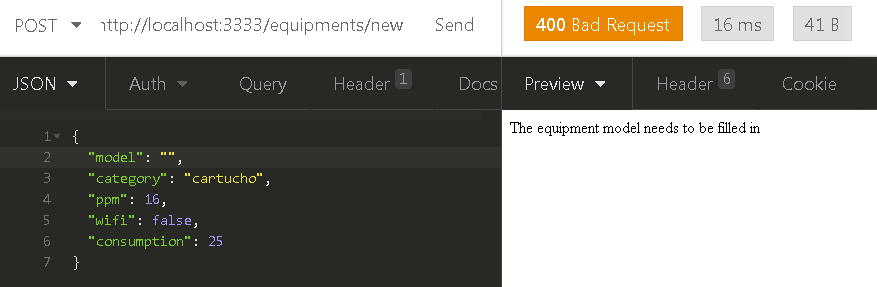

# Node.js CRUD Challenge

<hr>

- [Português](#portugues) :brazil:
- [English](#english) :us:

<hr>

## <a name="portugues"></a> README - Português :brazil:
Essa é uma API REST que desenvolvi para um desafio, e que basicamente pode, consultar, registrar, alterar e excluir dados de uma entidade no banco de dados, nesse caso a entidade representa equipamentos(equipamentos eletrônicos como impressoras, e afins)


## Tecnologias utilizadas :rocket:

 - [Node.js](https://nodejs.org/pt-br/) utilizando o framework [Express](https://expressjs.com/pt-br/)
 - [Knex.js](http://knexjs.org/) como QueryBuilder para poder fazer as operações no banco de dados de uma forma mais simplificada
 - [SQLite](https://www.sqlite.org/index.html) para o banco de dados

## O que aprendi com este projeto :dart:

Além de ter praticado meus conhecimentos em Javascript com Node.js, também pude praticar a interação com o banco de dados através do Knex.js, e que particularmente, nunca tinha usado em algo sozinho, mas resolvi dar uma chance a ele pois além de simples, é um Query Builder muito eficiente e simples de se trabalhar
   
## Como testar a API em sua máquina :arrow_forward:

Para testá-la, você precisará ter instalado em seu computador o [Git](https://git-scm.com), o [Node.js/NPM](https://nodejs.org/pt-br/) e algum software que possa testar APIs, eu recomendo o [Insomnia](https://insomnia.rest/download/) pois ele é muito fácil de se usar, simples e eficaz, baixe a versão Insomnia Core!

Passo a passo para testar a aplicação:
1. Vá em algum diretório do seu computador, e abra o Git Bash clicando com o botão direito do mouse no diretório que você escolheu, e escolha a opção "Git Bash Here", após isso siga os seguintes passos:

### Baixando o projeto
```bash
# Clone o repositório
$ git clone https://github.com/TiagoDiass/nodejs-crud-challenge.git

# Entre na pasta do repositório
$ cd nodejs-crud-challenge
```

2. Eu preparei algumas seeds para que você possa testar a API sem ter que ficar registrando dados manualmente, então, nós vamos instalar as dependências da API, executar as seeds, e depois iniciar a API, siga os passos abaixo: 

### Instalando as dependências e iniciando a API
```bash
# Instale as dependências
$ npm install 

# Executando as seeds para criação de alguns dados automáticos
$ npx knex seed:run

# Após ter instalado as dependências e executado as seeds, inicie a aplicação
$ npm start
```

3. Abra o Insomnia e siga estes passos:

      - Para testar a API no Insomnia, você pode começar criando um workspace clicando na setinha branca ao lado do nome do seu workspace atual, e dar a ele o nome que você quiser, nesse caso eu coloquei "Node.js Challenge".

      - Após isso você pode criar as requests/requisições, seguindo os seguintes passos, caso queira trocar o nome de alguma delas você pode, o importante é que você preste atenção ao método HTTP que está dando ao criar cada uma das requests, se baseie nos metódos que estão a esquerda dos nomes das requisições no print abaixo :arrow_heading_down:
      
      
      
      - <strong>Observação:</strong> Na criação das requisições "Create" e "Update", ao lado do método você terá um campo com as opções para o corpo da requisição, escolha a opção <strong>"JSON"</strong>, essa é a forma que enviaremos dados à API.
      
      - Após criar todas as requests como no print acima, coloque essas rotas para cada uma das requisições :arrow_heading_down:
      
- [Requisição List all](#pt-list)<br>
    Método GET<br>
    Rota da requisição: http://localhost:3333/equipments
    
- [Requisição Show one(que nos mostrará um equipamento especifício)](#pt-show)<br>
    Método GET<br>
    Rota da requisição: http://localhost:3333/equipments/id <br> (<strong>Obs:</strong> substitua o "id"  pelo ID do equipamento que você deseja ver)
    
- [Requisição Create](#pt-create)<br>
  Método POST<br>
  Rota da requisição: http://localhost:3333/equipments/new
  
- [Requisição Update](#pt-update)<br>
  Método PUT<br>
  Rota da requisição: http://localhost:3333/equipments/id <br>
  (<strong>Obs:</strong> substitua o "id"  pelo ID do equipamento que você deseja editar)
  
- [Requisição Delete](#pt-delete)<br>
  Método DELETE<br>
  Rota da requição: http://localhost:3333/equipments/id <br>
  (<strong>Obs:</strong> substitua o "id"  pelo ID do paciente que você deseja excluir)
  
  
## Testando a API :on:

Após ter criado todas as requisições, você pode começar a testá-las, o funcionamento da API é bem simples, através das requisições, você pode salvar, editar, mostrar e excluir dados de equipamentos eletrônicos.<br>

Como você executou a seed, alguns registros já estarão no banco de dados

#### Agora irei mostrar os possíveis resultados e retornos da API

### <a name="pt-list"></a>Requisição LIST ALL: 

Como o nome da requisição já diz, ela irá listar todos os registros dos equipments que estão no banco de dados, esse é o resultado ao executá-la(ah, e para executá-la, basta clicar no botão SEND, isso irá enviar a requisição para API) :arrow_heading_down:


### <a name="pt-show"></a>Requisição SHOW ONE: 

Essa requisição irá mostrar os dados de um equipamento específico, para utilizá-la você deve colocar o ID do equipamento que você deseja ver os dados na rota/endereço da requisição, como na imagem abaixo, que também nos mostra o resultado final da requisição passando o ID 3 como parâmetro :arrow_heading_down:


Caso o ID seja inválido, o resultado será o seguinte:


### <a name="pt-create"></a>Requisição CREATE: 

Essa é a requisição responsável por adicionar um novo equipamento aos registros, para utilizá-la você deve preencher o corpo da requisição com os seguintes dados: 
- model(<strong>obrigatório</strong>),
- category(<strong>obrigatório</strong>, valores possíveis são "cartucho" e "toner"),
- ppm(que significa páginas por minuto, <strong>NÃO é obrigatório</strong>, e caso não se aplique ao equipamento que você deseja cadastrar, você pode omitir ele da inserção do equipamento, ele ficará como null automaticamente, caso ele se aplique, você deve colocar um número maior do que zero)
- wifi(<strong>não obrigatório</strong>, caso não se aplique você pode omití-lo da inserção e ele resultará em null, caso queira preencher, coloque <strong>true</strong> ou <strong>false</strong>)
- consumption(<strong>não obrigatório</strong>, caso não se aplique você pode omití-lo da inserção e ele resultará em null, caso queira preencher, coloque um número maior do que zero)<br>

Você pode ver o exemplo nas imagens abaixo, após adicionar o equipamento, a resposta da requisição será os dados do equipamento que você adicionou :arrow_heading_down: <br>

Caso algum dado esteja inválido, a resposta indicará qual campo está errado, como na imagem abaixo:



Caso os dados estejam válidos, a resposta será os dados do equipamento criado, como na imagem abaixo:


### <a name="pt-update"></a>Requisição UPDATE: 

Essa é a requisição responsável por editar os dados de um equipamento, para utilizá-la você deve colocar o nome do dado que deseja alterar e seu respectivo valor, não se esqueça que o nome dos dados não podem ser diferente de: model, category, ppm, wifi e consumption.
Você pode seguir o exemplo na imagem abaixo, após editar o equipment, a resposta da requisição serão os novos dados do equipamento que você editou, veja abaixo :arrow_heading_down:

Caso o ID passado como parâmetro não exista no banco de dados, a resposta será assim:


Caso algum dado esteja inválido, a resposta indicará qual campo está errado, como na imagem abaixo:


Caso os dados escolhidos estejam válidos, a resposta será os novos dados do equipamento editado, como na imagem abaixo:


### <a name="pt-delete"></a>Requisição DELETE: 

Essa é a requisição responsável por deletar um equipamento, o resultado da requisição será um corpo vazio e o status 204(que significa "No content", sem conteúdo), para utilizar a requisição DELETE você deve colocar o ID do paciente na rota como nas imagens abaixo :arrow_heading_down:

Caso o ID passado como parâmetro não exista no banco de dados, a resposta será assim:


Caso o ID passado seja válido, a resposta será a seguinte:


<hr>

### Como parar a aplicação:

Após ter testado ela, você pode parar o seu funcionamento voltando ao terminal Git Bash que você utilizou para iniciar a API, e apertar <kbd>CTRL</kbd>+<kbd>C</kbd>, após isso a API será parada e você não conseguirá mais testá-la enquanto você não a iniciar novamente :)

#### Contato
- [Linkedin](https://www.linkedin.com/in/tiagodiass)
- Email: tiago.costadiasss@gmail.com

##### Espero que tenha gostado do projeto :smiley:

<hr>
<hr>

## <a name="english"></a> README - English :us:
This is a REST API that I developed for a challenge, which basically can, create, read, update and delete data of an entity in the database, in this case, this entity represents electronic equipments(like printers, and stuff like that)

## Used technologies :rocket:

 - [Node.js](https://nodejs.org/en/) using the framework [Express](https://expressjs.com/)
 - [Knex.js](http://knexjs.org/) as a QueryBuilder for me to interact with the database in a simpler way
 - [SQLite](https://www.sqlite.org/index.html) for the database

## What I learned from this project :dart:

I've practiced a lot of my knowledge about Javascript with Node.js, and I also could practice the interaction with the database throught the QueryBuilder Knex.js, which I've never used by myself before developing this API, it's very simple and easy to work with.

## How you can test the API in your computer :arrow_forward:

To test the API, you'll need to have the [Git](https://git-scm.com), and the [Node.js/NPM](https://nodejs.org/en/) and some software to test APIs, I recommend that you download a software called [Insomnia](https://insomnia.rest/download/) because it's very simple and easy to use, with that you'll be able to test the API(oh, download the CORE version of Insomnia!)

Step by step for you to test the API:
1. Go to some directory in your computer, and open the Git Bash clicking with the mouse right button in the directory that you chose, then select the option "Git Bash Here", after it you may follow the next steps:

### Downloading the repository
```bash
# Clone the repository
$ git clone https://github.com/TiagoDiass/nodejs-crud-challenge.git

# Enter on it folder
$ cd nodejs-crud-challenge
```

2. I've prepared some seeds for you to test the API without having to insert data manually, so, we're going to install the dependencies of the API, run the seeds, and then we'll start it, follow the next steps:

### Installing the dependencies and starting the API
```bash
# Install the dependencies
$ npm install 

# Run the seeds to create some automatic data
$ npx knex seed:run

# After having installed the dependencies and running the seeds, start the API
$ npm start
```

3. Open the Insomnia and follow the next steps:

      - To test the API in Insomnia, you can start creating a workspace clicking on the little white arrow next to the name of your current workspace, then give it the name that you want to give, in this case I chose "Node.js Challenge" but it doesn't really matter for you

      - After it you can start creating the requests, following the next steps. If you want to change the name of some of them, you can, but you must pay attention in the HTTP Methods that you're giving to each one of them, you can follow the names and the methods as in the screenshot below :arrow_heading_down:
      
      
      
      - <strong>Note:</strong> When you're creating the requests "Create" and "Update you should choose the option <strong>JSON</strong> for the request's body, this is the way we're going to send data for the API
      
      - After creating all of them as in the screenshot above, put these routes/addresses for each one of them :arrow_heading_down:
      
- [Request List all](#en-list)<br>
    Method: GET<br>
    Request's route: http://localhost:3333/equipments
    
- [Request Show one(which will show us the data of a specific equipment)](#en-show)<br>
    Method: GET<br>
    Request's route: http://localhost:3333/equipments/id <br> (<strong>Note:</strong> replace the "id" with the ID of the equipment that you want to find)
    
- [Request Create](#en-create)<br>
  Method: POST<br>
  Request's route: http://localhost:3333/equipments/new
  
- [Request Update](#en-update)<br>
  Method: PUT<br>
  Request's route: http://localhost:3333/equipments/id <br>
  (<strong>Note:</strong> replace the "id" with the ID of the equipment that you want to find)
  
- [Request Delete](#en-delete)<br>
  Method: DELETE<br>
  Request's route: http://localhost:3333/equipments/id <br>
  (<strong>Note:</strong> replace the "id" with the ID of the equipment that you want to delete)
  
  
## Testing the API :on:

After having created all the request, you can start testing them, the API works really simple, through the requests, you can read, create, update and delete data of equipments from the database.

As you already ran the seed, there will be some data in the database

#### The results and returns of the API

### <a name="en-list"></a>Request LIST ALL: 

As the name says, this request will list all the data of the equipments that are in the database, this is the result when you send it(to send it you can click on the "SEND" button, next to the request route) :arrow_heading_down:


### <a name="en-show"></a>Request SHOW ONE: 

This request will show us the data of an specific equipment, to use this request, you must put the ID of the equipment that you want to find, as in the screenshots below, that show us the request's response sendind 3 as the equipment ID :arrow_heading_down:


If the ID is invalid, the result will be:


### <a name="en-create"></a>Request CREATE: 

This is the request that will insert data of a new equipment in the database, to use this request you must fill in the request body following these rules for each one of these data:
- model(<strong>required</strong>),
- category(<strong>required</strong>, values can be "cartucho" or "toner"),
- ppm(<strong>not required</strong>, and if it doesn't apply to the equipment that you want to register, you can omit it from the body, it'll get null as default, if it applies, you must put a number greater than zero)
- wifi(<strong>not required</strong>, and if it doesn't apply to the equipment that you want to register, you can omit it from the body, it'll get null as default, if it applies, you must put <strong>true</strong> or <strong>false</strong>)
- consumption(<strong>not required</strong>, and if it doesn't apply to the equipment that you want to register, you can omit it from the body, it'll get null as default, if it applies, you must put a number greater than zero)

You can see the examples in the images below, after adding the equipment, the request's response will be the data that you added to the database :arrow_heading_down: <br>

If some field in invalid, the response will say what field is wrong, as in the image below:


If all the fields are valid, the response will be the created equipment, as in the image below:


### <a name="en-update"></a>Request UPDATE: 

This is the request that will edit/update the data of some equipment, to use this request you must put the field's name that you want to change in the database and then you can put it's values, don't forget that the fields' name cannot be different from: model, category, ppm, wifi and consumption.
You can follow the examples in the images below, after updating the equipment, the response will be the new data of that equipment :arrow_heading_down:

If the ID sent as a parameter is not valid, the response will be:


If some field are invalid, the response will indicate the field that is wrong, as in the image below:


If everything is ok, the response will be the new data of the edited equipment, as in the image below:


### <a name="en-delete"></a>Request DELETE: 

This is the request that will delete a equipment from the database, the result of this request will be an empty body with the status 204(which means "No content"). To send this request, you need to put the ID of the equipment that you want to delete as in the images below :arrow_heading_down:

If the ID sent as a parameter is invalid, the response will be:


If the ID is valid, the response will be:


<hr>

### How to stop the application:

After having tested it, you can stop it going back to the Git Bash that you opened to start the API, and then you can press <kbd>CTRL</kbd>+<kbd>C</kbd>, after it the API will be stopped and you'll not be able to test it while you don't start it again :)

#### Get in touch with me
- [Linkedin](https://www.linkedin.com/in/tiagodiass)
- Email: tiago.costadiasss@gmail.com

##### I hope you liked this project :smiley:

